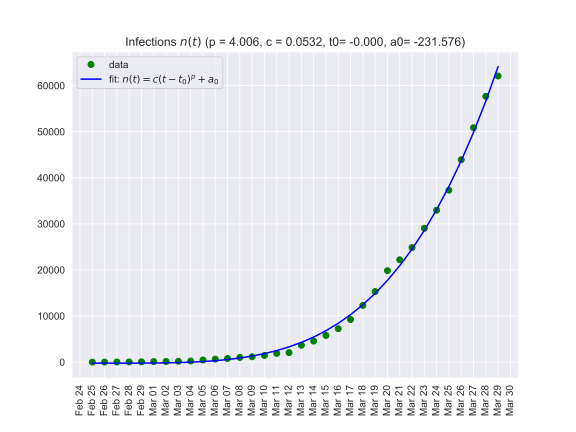
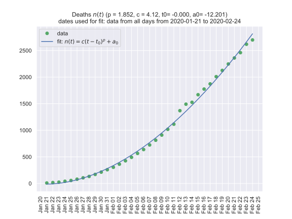

# coronavirus-2020
Predict increase in infections and deaths based on extrapolation of fit

- [Static view of notebook, rendered by github](model.ipynb)
- [Static view of notebook, rendered by nbviewer](https://nbviewer.jupyter.org/github/fangohr/coronavirus-2020/blob/master/model.ipynb)
- [Interactive session (allows execution and modification of notebook with Binder)](https://mybinder.org/v2/gh/fangohr/coronavirus-2020/master?filepath=model.ipynb)

## What is this?

- an exploration of the data on infection and deaths related to the Coronavirus outbreak early 2020
- all data used from https://www.worldometers.info/coronavirus/
- maybe this opens up the data and situation to more people (citizen science?) Anybody with a browser can re-execute and modify the analysis [here](https://mybinder.org/v2/gh/fangohr/coronavirus-2020/master?filepath=model.ipynb) (Jupyter Notebook and Python skills are needed).
- I find it useful to put statements in the press into the context of actual (reported) numbers
- disclaimer: this is not done by epidemiology experts, [don't trust anything here](https://github.com/fangohr/coronavirus-2020/blob/master/LICENSE)
- contributions and discussion is welcome of course
- raw data is available from this URL https://raw.githubusercontent.com/fangohr/coronavirus-2020/master/data.txt
- and some processed data is available at https://github.com/fangohr/coronavirus-2020/blob/master/figures/table-1.md
- it may not be possible to update this daily
- The "predictions" below are based on a very simple model of growth ($\proptot^p$), where we
  assume the same growth rate over the duration of the outbreak. We want to see
  these predictions to start to be wrong (and in particular to overestimate
  actual numbers; this would indicate the outbreak starts to be constrained).

## Update 7 February

It looks like the spread starts to slow down now - this is promising. 

This is best seen in the bar chart showing "New infections per day".

The predictions should here should now fail and overestimate actual numbers
(because the fitted model assumes constant growth during the whole outbreak, 
and actual data points of infection seem to start to deviate from this.
Would be interesting to check this quantitatively).

## Update 10 February

The trend shown in the chart "New infections per day" (of a decreasing number of
new infections reported per day) continues.

There is some discussion what could have cause the stop of increasing
infections, including:
- measures to reduce spread of the virus show impact
- capacities for carrying out tests are exhausted, i.e. we have a backlog of
  people who may be infected but cannot be tested fast enough
  (https://twitter.com/GaelVaroquaux/status/1226256025193525257)
- the classification of 'infected' may have been changed so that the reported
  numbers appear smaller (the change is associated with 7 Feb, see
  https://twitter.com/lwcalex/status/1226840055869632512). Apparently, people
  who do not show symptons are excluded from the reported numbers.
  
  ## Update 12 February
  
  With the new data from 12 February that shows a sudden increase in infection
  cases and deaths, it seems that indeed the previous data points were under
  reporting.
  
## Infections

The model doesn't fit the data very well anymore. (Fit was good until ~6 Feb)

The model fits the data pretty well.

## Deaths

## Predictions

In the tables below: "Prediction date" 31 January means that the prediction was
made with data available on the 31 Jan 2020. At that point, infections and
deaths were reported up to 30 January. The "1-day ahead prediction" is thus
predicting the numbers for 31 Jan (which typically become available the day
after, i.e. 1 Feb 2020 in this example).

As the basis for the data, we use the numbers from
https://www.worldometers.info/coronavirus/, which are shown when hovering with
the mouse over the data points in the two graphs. These are updated (according
to the graph) at at GMT+8h every day. (Other numbers on that webpage update more
frequently during the day.)

See [notebook](https://nbviewer.jupyter.org/github/fangohr/coronavirus-2020/blob/master/model.ipynb) for more details.

### Deaths

| Prediction date | 1-day ahead predicted  | actual  | 10 days ahead predicted   | actual          |
| --------------- | ---------------------: | ------: | ------------------------: | --------------: |
| 31 Jan 2020     | 262                    | 258     | 1072                      | 910             |
| 1 Feb 2020      | 312                    | 304     | 1120                      | 1018            |
| 2 Feb 2020      | 361                    | 362     | 1104                      | ?               |
| 3 Feb 2020      | 423                    | 426     | 1230                      | ?               |
| 4 Feb 2020      | 493                    | 492     | 1393                      | ?               |
| 5 Feb 2020      | 566                    | 565     | 1518                      | ?               |
| 6 Feb 2020      | 645                    | 638     | 1650                      | ?               |
| 7 Feb 2020      | 724                    | 724     | 1746                      | ?               |
| 8 Feb 2020      | 813                    | 813     | 1891                      | ?               |
| 9 Feb 2020      | ?                      | 910     |                           | ?               |
| 10 Feb 2020     | ?                      | 1018    |                           | ?               |
| 11 Feb 2020     | 1124                   | ?       | 2408                      | ?               |

### Infections

| Prediction date | 1-day ahead predicted  | actual  | 10 days ahead predicted   | actual      |
| --------------- | ---------------------: | ------: | ------------------------: | ----------: |
| 31 Jan 2020     | 12358                  | 11948   | 48558                     | 40553       |
| 1 Feb 2020      | 14687                  | 14551   | 50738                     | 43099       |
| 2 Feb 2020      | 17436                  | 17387   | 55286                     | ?           |
| 3 Feb 2020      | 20498                  | 20626   | 60621                     | ?           |
| 4 Feb 2020      | 23956                  | 24553   | 67084                     | ?           |
| 5 Feb 2020      | 28137                  | 28276   | 77138                     | ?           |
| 6 Feb 2020      | 32417                  | 31439   | 85451                     | ?           |
| 7 Feb 2020      | 36170                  | 34875   | 88039                     | ?           |
| 8 Feb 2020      | 39987                  | 37552   | 91704                     | ?           |
| 9 Feb 2020      | -                      | 40553   | -                         | ?           |
| 10 Feb 2020     | -                      | 43099   | -                         | ?           |
| 11 Feb 2020     | 49526                  | ?       | 95403                     | ?           |

