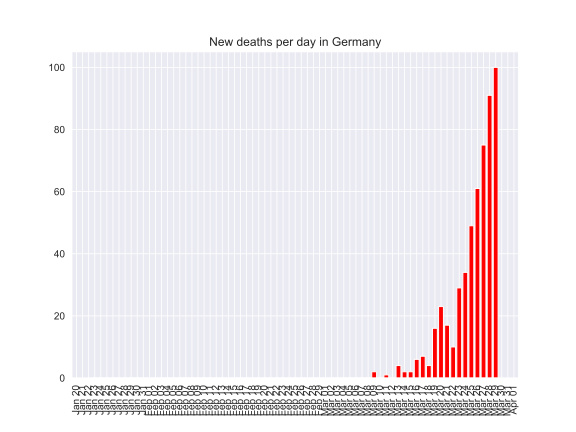

# coronavirus-2020 (covid2019)

This page isa little outdated. Nice plots are available at https://ourworldindata.org/coronavirus

What is available here?

- Offering data in Pandas dataFrame to explore.

- We use data from the files at https://github.com/CSSEGISandData/COVID-19/tree/master/csse_covid_19_data/csse_covid_19_time_series

  Thank you @CSSEGISandData for providing the data!

- An exploration of the early infection numbers in China is described in [this link](readme-old.md).

## See the sample notebook

- [Static view of notebook, germany.ipynb](https://nbviewer.jupyter.org/github/fangohr/coronavirus-2020/blob/master/germany.ipynb)

## Execute and modify the notebook using MyBinder

- [Interactive session germany.ipynb (allows execution and modification of notebook with Binder)](https://mybinder.org/v2/gh/fangohr/coronavirus-2020/master?filepath=germany.ipynb)

# Some plots with global numbers

Note: "Active" cases are those that are infected, not recovered and not dead.

<

# Some plots for Germany

# Fit model of type n(t) = c*(t-t0)^p + a0

# Predicting increase in infections

- Based on data since 25 Feb
- Assumes no significant change to containment measures 

[comment]: <> insert table here
<pre>
Predictions for cases in Germany:

Last data point used in prediction from 2020-03-27 00:00:00

Infections in  1 days:  57833 (28 Mar 2020)
Infections in  2 days:  65676 (29 Mar 2020)
Infections in  3 days:  74297 (30 Mar 2020)
Infections in  4 days:  83748 (31 Mar 2020)
Infections in  5 days:  94082 (01 Apr 2020)
Infections in  6 days: 105351 (02 Apr 2020)
Infections in  7 days: 117614 (03 Apr 2020)
Infections in  8 days: 130927 (04 Apr 2020)
Infections in  9 days: 145350 (05 Apr 2020)
Infections in 10 days: 160944 (06 Apr 2020)
Infections in 11 days: 177773 (07 Apr 2020)
Infections in 12 days: 195902 (08 Apr 2020)
Infections in 13 days: 215396 (09 Apr 2020)
Infections in 14 days: 236324 (10 Apr 2020)
Infections in 15 days: 258757 (11 Apr 2020)
Infections in 16 days: 282765 (12 Apr 2020)
Infections in 17 days: 308424 (13 Apr 2020)
Infections in 18 days: 335808 (14 Apr 2020)
Infections in 19 days: 364994 (15 Apr 2020)
Infections in 20 days: 396062 (16 Apr 2020)
Infections in 21 days: 429092 (17 Apr 2020)
Infections in 22 days: 464168 (18 Apr 2020)
Infections in 23 days: 501372 (19 Apr 2020)
Infections in 24 days: 540792 (20 Apr 2020)
Infections in 25 days: 582516 (21 Apr 2020)
Infections in 26 days: 626632 (22 Apr 2020)
Infections in 27 days: 673235 (23 Apr 2020)
Infections in 28 days: 722415 (24 Apr 2020)
Infections in 29 days: 774270 (25 Apr 2020)

Fit parameters: p = 4.124 c = 0.036 t0= -0.000 a0= -134.534</pre>
