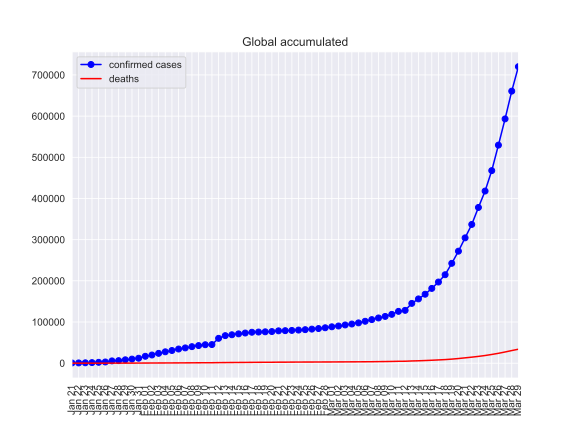
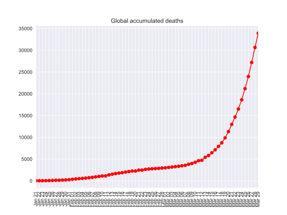
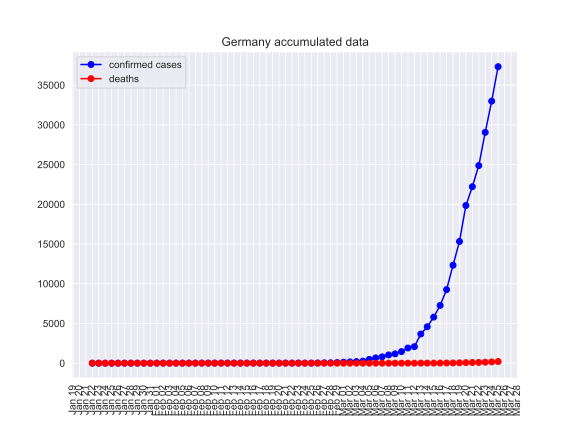

# coronavirus-2020 (covid2019)

- Offering data in Pandas dataFrame to explore.

- We use data from the files at https://github.com/CSSEGISandData/COVID-19/tree/master/csse_covid_19_data/csse_covid_19_time_series

  Thank you @CSSEGISandData for providing the data!

- An exploration of the early infection numbers in China is described in [this link](readme-old.md).

## See the sample notebook

- [Static view of notebook, germany.ipynb](https://nbviewer.jupyter.org/github/fangohr/coronavirus-2020/blob/master/germany.ipynb)

## Execute and modify the notebook using MyBinder

- [Interactive session germany.ipynb (allows execution and modification of notebook with Binder)](https://mybinder.org/v2/gh/fangohr/coronavirus-2020/master?filepath=germany.ipynb)

# Some plots with global numbers

Note: "Active" cases are those that are infected, not recovered and not dead.

# Some plots for Germany

# Fit model of type n(t) = c*(t-t0)^p + a0

# Predicting increase in infections

- Based on data since 25 Feb
- Assumes no significant change to containment measures 

[comment]: <> insert table here
<pre>
Predictions for cases in Germany:

Last data point used in prediction from 2020-03-25 00:00:00

Infections in  1 days:  44446 (26 Mar 2020)
Infections in  2 days:  50925 (27 Mar 2020)
Infections in  3 days:  58095 (28 Mar 2020)
Infections in  4 days:  66004 (29 Mar 2020)
Infections in  5 days:  74703 (30 Mar 2020)
Infections in  6 days:  84242 (31 Mar 2020)
Infections in  7 days:  94677 (01 Apr 2020)
Infections in  8 days: 106063 (02 Apr 2020)
Infections in  9 days: 118456 (03 Apr 2020)
Infections in 10 days: 131917 (04 Apr 2020)
Infections in 11 days: 146507 (05 Apr 2020)
Infections in 12 days: 162287 (06 Apr 2020)
Infections in 13 days: 179323 (07 Apr 2020)
Infections in 14 days: 197681 (08 Apr 2020)
Infections in 15 days: 217429 (09 Apr 2020)
Infections in 16 days: 238638 (10 Apr 2020)
Infections in 17 days: 261380 (11 Apr 2020)
Infections in 18 days: 285727 (12 Apr 2020)
Infections in 19 days: 311756 (13 Apr 2020)
Infections in 20 days: 339544 (14 Apr 2020)
Infections in 21 days: 369171 (15 Apr 2020)
Infections in 22 days: 400718 (16 Apr 2020)
Infections in 23 days: 434267 (17 Apr 2020)
Infections in 24 days: 469904 (18 Apr 2020)
Infections in 25 days: 507716 (19 Apr 2020)
Infections in 26 days: 547791 (20 Apr 2020)
Infections in 27 days: 590220 (21 Apr 2020)
Infections in 28 days: 635095 (22 Apr 2020)
Infections in 29 days: 682511 (23 Apr 2020)

Fit parameters: p = 4.139 c = 0.0343 t0= -0.000 a0= -127.289</pre>
