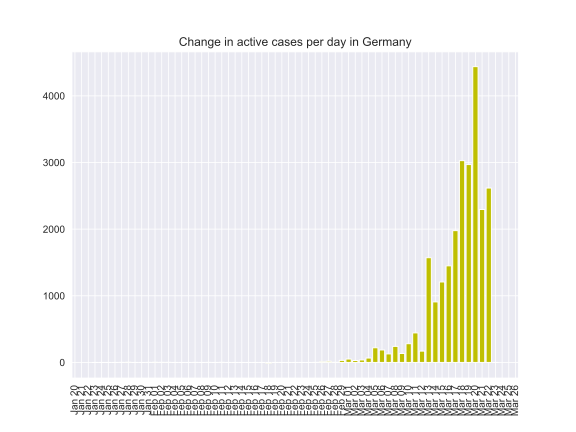

# coronavirus-2020 (covid2019)

- Offering data in Pandas dataFrame to explore.

- We use data from the files at https://github.com/CSSEGISandData/COVID-19/tree/master/csse_covid_19_data/csse_covid_19_time_series

  Thank you @CSSEGISandData for providing the data!

- An exploration of the early infection numbers in China is described in [this link](readme-old.md).

## See the sample notebook

- [Static view of notebook, germany.ipynb](https://nbviewer.jupyter.org/github/fangohr/coronavirus-2020/blob/master/germany.ipynb)

## Execute and modify the notebook using MyBinder

- [Interactive session germany.ipynb (allows execution and modification of notebook with Binder)](https://mybinder.org/v2/gh/fangohr/coronavirus-2020/master?filepath=germany.ipynb)

# Some plots with global numbers

Note: "Active" cases are those that are infected, not recovered and not dead.

# Some plots for Germany

