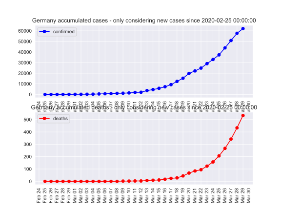

# coronavirus-2020 (covid2019)

- Offering data in Pandas dataFrame to explore.

- We use data from the files at https://github.com/CSSEGISandData/COVID-19/tree/master/csse_covid_19_data/csse_covid_19_time_series

  Thank you @CSSEGISandData for providing the data!

- An exploration of the early infection numbers in China is described in [this link](readme-old.md).

## See the sample notebook

- [Static view of notebook, germany.ipynb](https://nbviewer.jupyter.org/github/fangohr/coronavirus-2020/blob/master/germany.ipynb)

## Execute and modify the notebook using MyBinder

- [Interactive session germany.ipynb (allows execution and modification of notebook with Binder)](https://mybinder.org/v2/gh/fangohr/coronavirus-2020/master?filepath=germany.ipynb)

# Some plots with global numbers

Note: "Active" cases are those that are infected, not recovered and not dead.

# Some plots for Germany

# Fit model of type n(t) = c*(t-t0)^p + a0

# Predicting increase in infections

- Based on data since 25 Feb
- Assumes no significant change to containment measures 

[comment]: <> insert table here
<pre>
Predictions for cases in Germany:

Last data point used in prediction from 2020-03-23 00:00:00

Infections in  1 days:  34390 (24 Mar 2020)
Infections in  2 days:  39867 (25 Mar 2020)
Infections in  3 days:  45980 (26 Mar 2020)
Infections in  4 days:  52779 (27 Mar 2020)
Infections in  5 days:  60314 (28 Mar 2020)
Infections in  6 days:  68639 (29 Mar 2020)
Infections in  7 days:  77809 (30 Mar 2020)
Infections in  8 days:  87880 (31 Mar 2020)
Infections in  9 days:  98912 (01 Apr 2020)
Infections in 10 days: 110965 (02 Apr 2020)
Infections in 11 days: 124104 (03 Apr 2020)
Infections in 12 days: 138392 (04 Apr 2020)
Infections in 13 days: 153898 (05 Apr 2020)
Infections in 14 days: 170691 (06 Apr 2020)
Infections in 15 days: 188842 (07 Apr 2020)
Infections in 16 days: 208425 (08 Apr 2020)
Infections in 17 days: 229515 (09 Apr 2020)
Infections in 18 days: 252190 (10 Apr 2020)
Infections in 19 days: 276531 (11 Apr 2020)
Infections in 20 days: 302619 (12 Apr 2020)
Infections in 21 days: 330538 (13 Apr 2020)
Infections in 22 days: 360376 (14 Apr 2020)
Infections in 23 days: 392219 (15 Apr 2020)
Infections in 24 days: 426160 (16 Apr 2020)
Infections in 25 days: 462291 (17 Apr 2020)
Infections in 26 days: 500706 (18 Apr 2020)
Infections in 27 days: 541504 (19 Apr 2020)
Infections in 28 days: 584784 (20 Apr 2020)
Infections in 29 days: 630648 (21 Apr 2020)

Fit parameters: p = 4.189 c = 0.03 t0= -0.000 a0= -195.578</pre>
