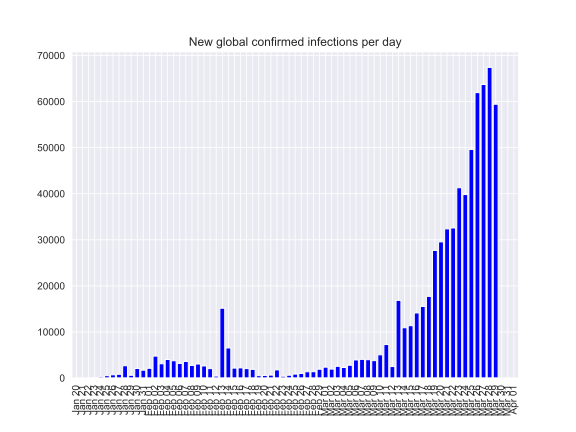

# coronavirus-2020 (covid2019)

- Offering data in Pandas dataFrame to explore.

- We use data from the files at https://github.com/CSSEGISandData/COVID-19/tree/master/csse_covid_19_data/csse_covid_19_time_series

  Thank you @CSSEGISandData for providing the data!

- An exploration of the early infection numbers in China is described in [this link](readme-old.md).

## See the sample notebook

- [Static view of notebook, germany.ipynb](https://nbviewer.jupyter.org/github/fangohr/coronavirus-2020/blob/master/germany.ipynb)

## Execute and modify the notebook using MyBinder

- [Interactive session germany.ipynb (allows execution and modification of notebook with Binder)](https://mybinder.org/v2/gh/fangohr/coronavirus-2020/master?filepath=germany.ipynb)

# Some plots with global numbers

Note: "Active" cases are those that are infected, not recovered and not dead.

# Some plots for Germany

# Fit model of type n(t) = c*(t-t0)^p + a0

# Predicting increase in infections

- Based on data since 25 Feb
- Assumes no significant change to containment measures 

[comment] insert table here
Predictions for cases in Germany:

Last data point used in prediction from 2020-03-09 00:00:00

Infections in  1 days:   1488 (10 Mar 2020)
Infections in  2 days:   1798 (11 Mar 2020)
Infections in  3 days:   2147 (12 Mar 2020)
Infections in  4 days:   2536 (13 Mar 2020)
Infections in  5 days:   2967 (14 Mar 2020)
Infections in  6 days:   3442 (15 Mar 2020)
Infections in  7 days:   3964 (16 Mar 2020)
Infections in  8 days:   4533 (17 Mar 2020)
Infections in  9 days:   5152 (18 Mar 2020)
Infections in 10 days:   5822 (19 Mar 2020)
Infections in 11 days:   6545 (20 Mar 2020)
Infections in 12 days:   7323 (21 Mar 2020)
Infections in 13 days:   8157 (22 Mar 2020)
Infections in 14 days:   9050 (23 Mar 2020)
Infections in 15 days:  10003 (24 Mar 2020)
Infections in 16 days:  11017 (25 Mar 2020)
Infections in 17 days:  12095 (26 Mar 2020)
Infections in 18 days:  13237 (27 Mar 2020)
Infections in 19 days:  14446 (28 Mar 2020)
Infections in 20 days:  15723 (29 Mar 2020)
Infections in 21 days:  17070 (30 Mar 2020)
Infections in 22 days:  18488 (31 Mar 2020)
Infections in 23 days:  19979 (01 Apr 2020)
Infections in 24 days:  21545 (02 Apr 2020)
Infections in 25 days:  23186 (03 Apr 2020)
Infections in 26 days:  24905 (04 Apr 2020)
Infections in 27 days:  26703 (05 Apr 2020)
Infections in 28 days:  28581 (06 Apr 2020)
Infections in 29 days:  30542 (07 Apr 2020)

Fit parameters: p = 2.754 c = 1.03 t0= -0.000 a0= 5.903
